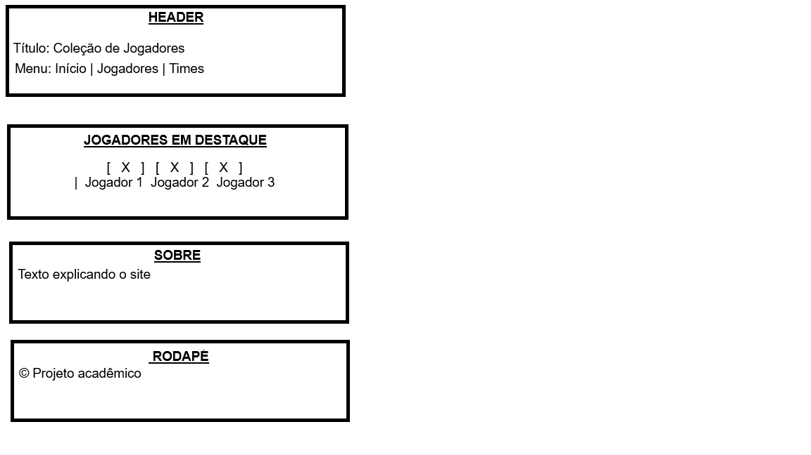
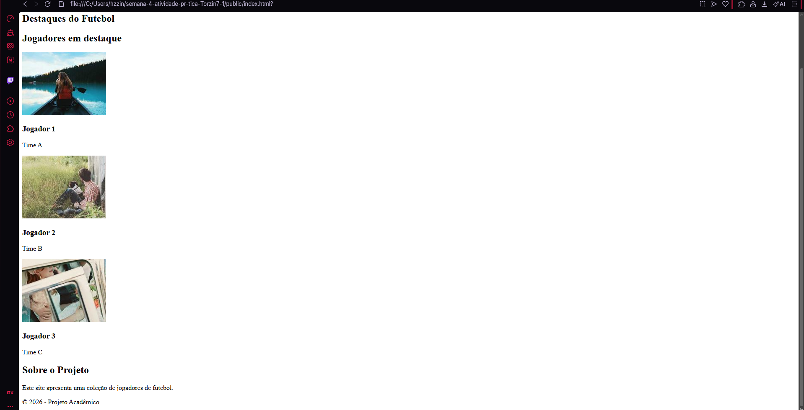

# Trabalho Prático - Semana 04

Dessa vez, vamos escolher uma proposta de projeto para trabalhar.

Nessa atividade, você deverá montar a página inicial do projeto escolhido, a organização do HTML aplicando semântica correta e uso aprimorado do CSS. Leia o enunciado completo no Canvas para mais detalhes.

**IMPORTANTE:** Você deve trabalhar e alterar apenas arquivos dentro da pasta **`public`**. Deixe todos os demais arquivos e pastas desse repositório inalterados. **PRESTE MUITA ATENÇÃO NISSO.**

## Informações Gerais

- Nome: Heitor Gonçalves  
- Matricula: XXXXX  
- Proposta de projeto escolhida: Coleções e Itens  
- Breve descrição sobre seu projeto:
O projeto consiste em uma aplicação web que apresenta uma coleção de jogadores de futebol, exibindo informações e imagens de cada jogador.

## Print do(s) wireframe(s) criado
> Sugestão, use o Excalidraw para isso. Utilize esse [template básico](https://excalidraw.com/#json=LU-8hwcQEwzk11FwO8Opo,qPU9K6cNUEzlXzwOuKMIlQ) para você começar. 

<<  >>

## Print da home-page criada

<<   >>

[def]: wireframe.png